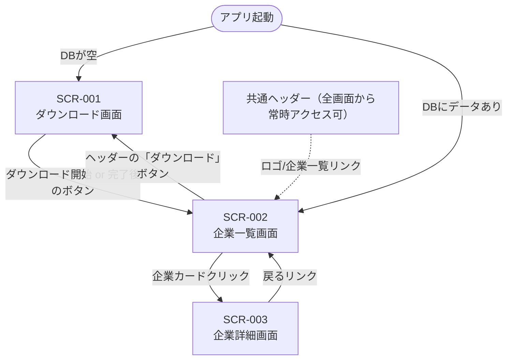

# 画面遷移図

画面一覧は[screen_list.md](screen_list.md)参照。各画面の詳細な遷移条件は
各`SCR-XXX_*.md`本体に書く。このファイルは全体像を俯瞰するためのMermaid図のみを持つ
（常に最終断面。個々の遷移の理由・経緯は各画面ドキュメント側に書く）。

## 備考

- 共通ヘッダーは全画面に表示され、ロゴ・「企業一覧」リンクから常にSCR-002へ
  戻れる（`frontend/src/components/Header.tsx`）
- 新しいユースケースの実装で新規画面・新規遷移が発生した場合、このMermaid図に
  ノード・矢印を追記する（[cycle-workflow](../../../.claude/skills/cycle-workflow/SKILL.md)の
  「画面フローの整理」ステップ）
