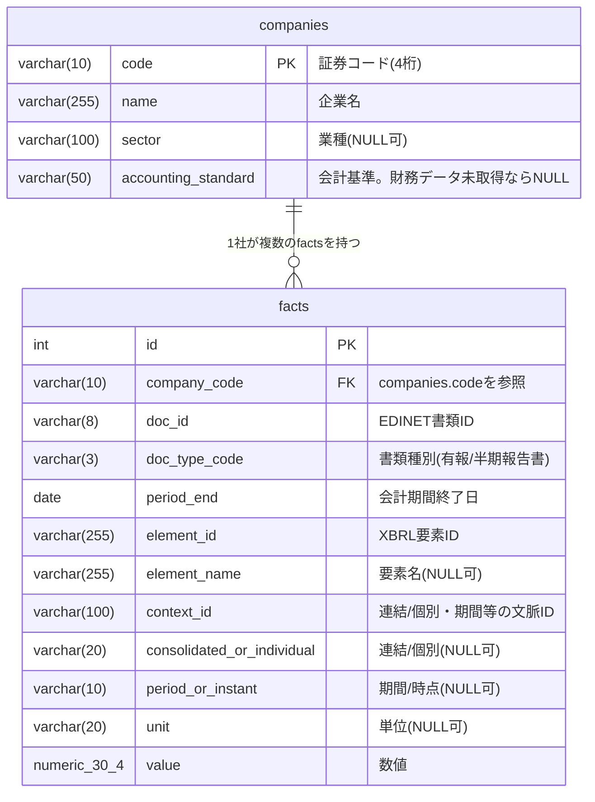

# ER図（テーブル関係図）

対象：`docs/design/table/table_list.md`のテーブル一覧に対応する実際のER図。
テーブルは現在2つのみ（`TBL-002 financials`はサイクル2で廃止済み、`TBL-003 facts`に
置き換わっている）。

## 読み方

- `companies`（TBL-001）：企業マスタ。1行＝1企業
- `facts`（TBL-003）：EDINETから取得した数値データを、勘定科目（要素ID）単位で
  1行ずつ保持する汎用テーブル。1企業に対して大量の行がぶら下がる
  （例：33社で約31万行、1社平均約9,400行）
- 関係は**1対多**（`companies.code` ← `facts.company_code`）のみ。企業を削除すると
  紐づく`facts`も連動して消える（`ON DELETE CASCADE`）
- `facts`は「売上高」「純利益」のような個別カラムを持たない。同じテーブルの中に
  あらゆる勘定科目が`element_id`で区別されて並んでおり、画面表示用の
  「売上高」「ROE」等の指標は、アプリ側（`backend/metric_mappings.py`等）が
  `element_id`ごとの値を都度組み立てて計算している
- `companies.accounting_standard`が`NULL`の企業は、基本情報のみ登録済みで
  財務データ（＝紐づく`facts`行）がまだ0件の企業（サイクル6 FR-39・FR-40）

## 一意制約・インデックス

| テーブル | 種類 | 対象カラム | 目的 |
|---|---|---|---|
| facts | UNIQUE | company_code, doc_id, element_id, context_id | 同じ書類・同じ要素・同じ文脈の重複行を防ぐ |
| facts | INDEX | company_code, element_id | 指標計算時の絞り込みを高速化 |
| facts | INDEX | company_code, period_end | 年度範囲指定（FR-12）でのクエリを高速化 |

## 廃止済みテーブル（参考）

`TBL-002 financials`（サイクル1で導入、サイクル2で廃止）は、勘定科目ごとに固定カラムを
持つ設計（`revenue`・`operating_profit`等）だった。新しい勘定科目が増えるたびにカラムを
追加する必要があり拡張性が低いため、汎用的な`facts`テーブルに置き換えられた
（詳細：[TBL-003_facts.md](TBL-003_facts.md)）。
