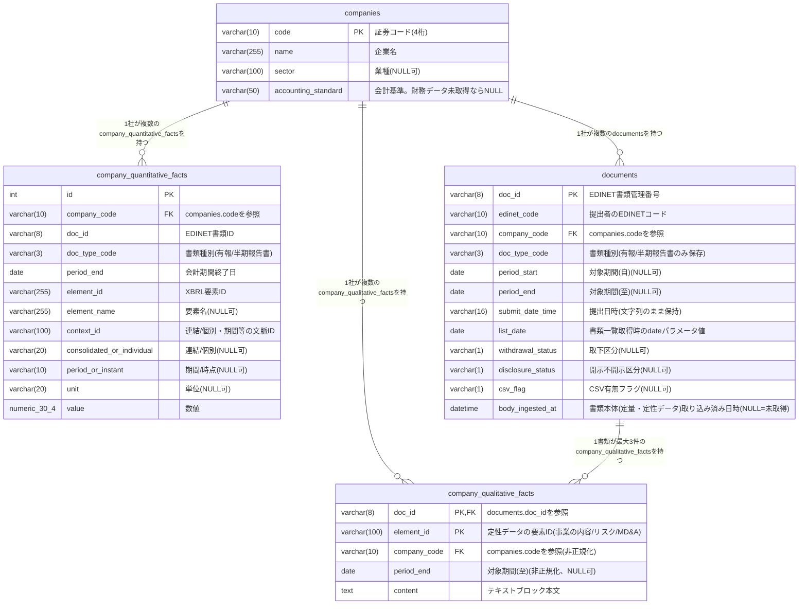

# ER図（テーブル関係図）

対象：`docs/design/table/table_list.md`のテーブル一覧に対応する実際のER図。
現行テーブルは4つ（`TBL-002 financials`はサイクル2で廃止済み、
`TBL-003 company_quantitative_facts`に置き換わっている）。

## 読み方

- `companies`（TBL-001）：企業マスタ。1行＝1企業
- `company_quantitative_facts`（TBL-003、旧名`facts`。サイクル13で命名是正）：
  EDINETから取得した数値データを、勘定科目（要素ID）単位で1行ずつ保持する
  汎用テーブル。1企業に対して大量の行がぶら下がる（例：33社で約31万行、
  1社平均約9,400行）
- `documents`（TBL-004、サイクル9新設）：EDINETの書類一覧APIで発見した「書類の存在」を
  保持する索引テーブル。`company_quantitative_facts`とは別系統で、まだ取り込んで
  いない書類も含む（`body_ingested_at`が`NULL`のものが未取込）
- `companies`から見て`company_quantitative_facts`・`documents`・
  `company_qualitative_facts`はいずれも1対多。`company_quantitative_facts`と
  `documents`の間には直接の外部キー関係を持たない（`doc_id`は両方に存在するが、
  参照制約は設けていない。両者は「値そのもの」と「書類の存在」という異なる
  関心事を表すため）。企業を削除すると紐づく行がすべて連動して消える
  （`ON DELETE CASCADE`）
- `company_quantitative_facts`は「売上高」「純利益」のような個別カラムを持たない。
  同じテーブルの中にあらゆる勘定科目が`element_id`で区別されて並んでおり、
  画面表示用の「売上高」「ROE」等の指標は、アプリ側
  （`backend/metric_mappings.py`等）が`element_id`ごとの値を都度組み立てて
  計算している
- `companies.accounting_standard`が`NULL`の企業は、基本情報のみ登録済みで
  財務データ（＝紐づく`company_quantitative_facts`行）がまだ0件の企業
  （サイクル6 FR-39・FR-40）
- `company_qualitative_facts`（TBL-005、サイクル13新設）：`documents`と同じCSVから
  抽出した定性データ（事業の内容・リスク・MD&A）のテキストブロックを保持する。
  `documents`とは`doc_id`で直接の外部キー関係を持つ（1書類につき最大3行）。
  `company_quantitative_facts`とは、`documents`同様、直接の外部キー関係を持たない
  （同じCSVに由来するが、テーブルの関心事＝定量／定性が異なるため）

## 一意制約・インデックス

| テーブル | 種類 | 対象カラム | 目的 |
|---|---|---|---|
| company_quantitative_facts | UNIQUE | company_code, doc_id, element_id, context_id | 同じ書類・同じ要素・同じ文脈の重複行を防ぐ |
| company_quantitative_facts | INDEX | company_code, element_id | 指標計算時の絞り込みを高速化 |
| company_quantitative_facts | INDEX | company_code, period_end | 年度範囲指定（FR-12）でのクエリを高速化 |
| documents | INDEX | company_code, body_ingested_at | 「この企業の未取得書類」の絞り込みを高速化 |
| documents | INDEX | list_date | バックフィルの進捗確認を高速化 |
| company_qualitative_facts | INDEX | company_code, period_end | 「この企業の指定年度の定性データ」を取得するクエリを高速化 |

## 廃止済みテーブル（参考）

`TBL-002 financials`（サイクル1で導入、サイクル2で廃止）は、勘定科目ごとに固定カラムを
持つ設計（`revenue`・`operating_profit`等）だった。新しい勘定科目が増えるたびにカラムを
追加する必要があり拡張性が低いため、汎用的な`company_quantitative_facts`テーブルに
置き換えられた（詳細：[TBL-003_company_quantitative_facts.md](TBL-003_company_quantitative_facts.md)）。

## 各テーブルの詳細定義

- [TBL-001_companies.md](TBL-001_companies.md)
- [TBL-003_company_quantitative_facts.md](TBL-003_company_quantitative_facts.md)
- [TBL-004_documents.md](TBL-004_documents.md)
- [TBL-005_company_qualitative_facts.md](TBL-005_company_qualitative_facts.md)
